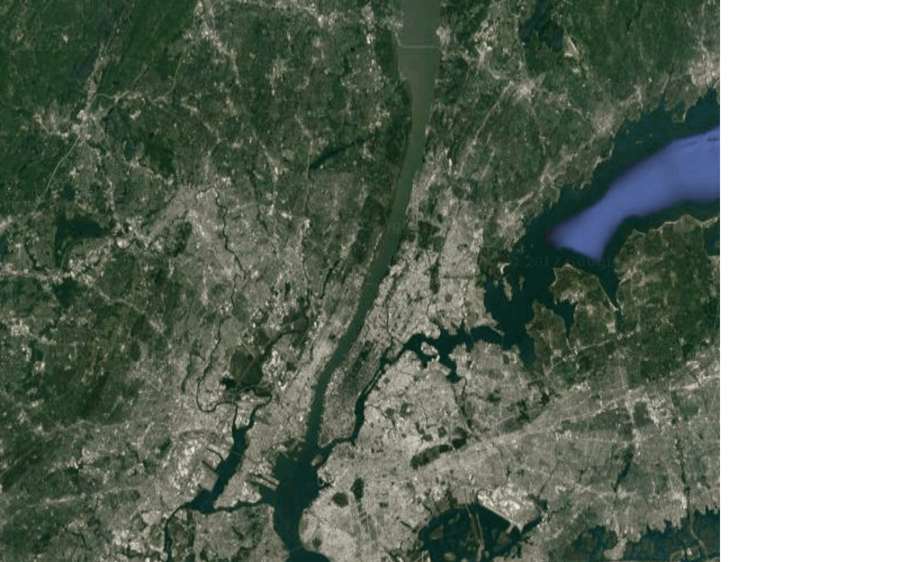

# Mappa

**_This project is currently in development_**

Mappa is a library to facilitate work between [p5.js](https://github.com/processing/p5.js) and existing map libraries. It provides a set of tools for displaying static images, tile maps, geolocation, zoom and panning control among other useful things when building geolocation-based visual representations.
Although Mappa was originally designed for [p5.js](https://github.com/processing/p5.js), it can be used with other libraries that use the canvas element as the render object.

# Usage

Just add the library in your head tag. Mappa will automatically load any third-party map provider library when necessary.

```html
<head>
  <script src="p5.min.js"></script>
  <script src="mappa.js"></script>
</head>
```
Then create a `new Mappa` instance with your preferred map provider.

```javascript
// API key for map provider.
var key = 'abcd'

// Create a new Mappa instance.
var mappa = new Mappa('Map-Provider', key);
```
In most cases an API is required. Check [this guide]() to learn how to get an API and set proper permission depending on your provider.

For static maps, [Google Maps Static API](https://developers.google.com/maps/documentation/static-maps/), [Mapbox Static API](https://www.mapbox.com/api-documentation/#styles) and [Mapquest Static API](https://developer.mapquest.com/documentation/static-map-api/v5/) are supported.

For tile maps, [Google Maps](https://developers.google.com/maps/documentation/javascript/), [Mapbox](https://www.mapbox.com/mapbox.js/api/v3.1.1/), [Mapbox-GL](https://www.mapbox.com/mapbox-gl-js/api/), [Mapzen](https://mapzen.com/documentation/mapzen-js/api-reference/), [Tangram](https://mapzen.com/documentation/tangram/Javascript-API/) and [Leaflet](http://leafletjs.com/) are supported.

If you are new to maps, check out [this glossary of terms]().

# Examples
+ Static Maps
- Google Maps ([Code](examples/static/Google) | [Demo](https://cvalenzuela.github.io/Mappa/examples/static/Google/))
- Mapbox ([Code](examples/static/Mapbox) | [Demo](https://cvalenzuela.github.io/Mappa/examples/static/Mapbox/))
- Mapquest ([Code](examples/static/Mapquest) | [Demo](https://cvalenzuela.github.io/Mappa/examples/static/Mapquest/))

+ Tile Maps
- Google Maps ([Code](examples/tile/Google) | [Demo](https://cvalenzuela.github.io/Mappa/examples/tile/Google/))
- Mapbox ([Code](examples/tile/Mapbox) | [Demo](https://cvalenzuela.github.io/Mappa/examples/tile/Mapbox/))
- Mapbox Gl ([Code](examples/tile/Mapboxgl) | [Demo](https://cvalenzuela.github.io/Mappa/examples/tile/Mapboxgl/))
- Mapzen ([Code](examples/tile/Mapzen) | [Demo](https://cvalenzuela.github.io/Mappa/examples/tile/Mapzen/))
- Tangram ([Code](examples/tile/Tangram) | [Demo](https://cvalenzuela.github.io/Mappa/examples/tile/Tangram/))
- Leaflet ([Code](examples/tile/Leaflet) | [Demo](https://cvalenzuela.github.io/Mappa/examples/tile/Leaflet/))
- Using p5 in WEBGL mode ([Code](examples/tile/Webgl) | [Demo](https://cvalenzuela.github.io/Mappa/examples/tile/Webgl/))

# Reference

+ [staticMap()](#staticmapoptions)
+ [tileMap()](#tilemapoptions)
+ [append()](#appendcanvas)
+ [latLng()](#latlnglat-lng)
+ [zoom()](#zoom)
+ [~~pixelToLatlng()~~](#pixeltolatlng)
+ [onChange()](#onchangefunction)
+ [~~loadGeoJSON~~](loadgeojson)
+ [~~geoCoding~~](#geocoding)

---

#### staticMap(options)

> Creates a static map image with the provided parameters.

Mappa provides a simple interface when working with static maps. It currently supports [Google Maps Static API](https://developers.google.com/maps/documentation/static-maps/), [Mapbox Static API](https://www.mapbox.com/api-documentation/#styles) and [Mapquest Static API](https://developer.mapquest.com/documentation/static-map-api/v5/).

`staticMap(lat, lng, zoom, width, height, [optional])` or `staticMap(parameters)`

Examples:
```javascript
// Create an image of New York of 500x500 with a zoom level of 10.
var myMap = mappa.staticMap(40.782, -73.967, 10, 500, 500)
```

```javascript
var options = {
  lat: 40.782,
  lng: -73.967,
  zoom: 10,
  width: 500,
  height: 500
}
// Create an image of New York of 500x500 with a zoom level of 10.
var myMap = mappa.staticMap(options)
```

The resulting URL of the image will be stored inside the `img` value of the myMap variable. To load the image in p5 use [`loadImage()`](https://p5js.org/reference/#/p5/loadImage) in [`preload()`](https://p5js.org/reference/#/p5/preload) as with any other p5 image:

```javascript
var img;

function preload(){
  img = loadImage(myMap.img);
}
```

to use it into other elements just refer to `myMap.img`.

Required parameters:
+ `lat`: latitude for the center of the image.
+ `lng`: longitude for the center of the image.
+ `zoom`: zoom of the image. Min 1. Max 16.
+ `width`: width in pixels.
+ `height`: height in pixels.

Optional:
+ Google:
- `scale`: number of pixels returned. Defaults to `1`.
- `format`: gif, png or jpg. Defaults to `png`.
- `language`: language of the map. Defaults to `english`.
- `maptype`: Type of map used. Defaults to `roadmap`.

For a complete reference visit [Google Maps Static API Documentation](https://developers.google.com/maps/documentation/static-maps/intro).

+ Mapbox:
- `scale`: number of pixels returned. Defaults to `1`.
- `pitch`: tilts the map. Defaults to `0`.
- `bearing`: rotates the map around its center. Defaults to `0`.
- `style`: mapbox styles. default to `satellite-streets-v10`.
- `attribution`:  boolean value to show map attribution. Defaults to `true`.
- `logo`: boolean value to show mapbox logo on the image; defaults to `true`.

For a complete reference visit [Mapbox Static API Documentation](https://www.mapbox.com/api-documentation/#static).

+ Mapquest:
+ `scale`: number of pixels returned. Defaults to `1`.
+ `type`: Type of map used. Defaults to `hyb`.
+ `scalebar`: boolean value to show a scale. Defaults to `false`.
+ `traffic`: boolena to show traffic flow. Defaults to `false`.
+ `banner`: add a custom banner.

For a complete reference visit [Mapquest Static API Documentation](https://developer.mapquest.com/documentation/static-map-api/v5/).

##### Complete Example:

```javascript

// Your Google Maps API Key
var key = 'abcd'

// Create a new Mappa instance using Google.
var mappa = new Mappa('Google', key);

// Map options
var options = {
  lat: 40.782,
  lng: -73.967,
  zoom: 10,
  width: 640,
  height: 640,
  scale: 1,
  format: 'PNG',
  language: 'en',
  maptype: 'satellite'
}
var img;

// Create an image of New York.
var myMap = mappa.staticMap(options);

// Load the image from the mappa instance as any other p5 image.
function preload(){
  img = loadImage(myMap.img);
}

function setup(){
  createCanvas(640,640);
  image(img, 0, 0);
}

```
This will render the following image:


Here are more complete examples when working with [Google Maps](examples/static/Google), [Mapbox](examples/static/Mapbox) and [Mapquest](examples/static/Mapquest).

#### tileMap(options)

> Creates a tile map with the provided parameters. This method needs to be called inside [`setup()`](https://p5js.org/reference/#/p5/setup). It needs to be used together with [`append()`](#appendcanvas) to display a map.

Mappa allows to overlay a canvas element in top of [tile maps](glossary/tile-maps). This is useful for interactive geolocation-based visual sketches. It currently supports [Google Maps](https://developers.google.com/maps/documentation/javascript/), [Mapbox](https://www.mapbox.com/mapbox.js/api/v3.1.1/), [Mapbox-GL](https://www.mapbox.com/mapbox-gl-js/api/), [Mapzen](https://mapzen.com/documentation/mapzen-js/api-reference/) and [Tangram](https://mapzen.com/documentation/tangram/Javascript-API/) as map providers. It also supports [Leaflet](http://leafletjs.com/) with any custom set of tiles. [`tileMap()`](#tilemapoptions) will only create the reference to a tile map. In order to visualize the map, [`append()`](#appendcanvas) must be used.

`tileMap(lat, lng, zoom, [optional])` or `tileMap(parameters)`

Example:

```javascript
var canvas;
var myMap;

function setup(){
  canvas = createCanvas(800, 700);
  // Create a tile map centered in New York with an initial zoom level of 10.
  myMap = mappa.tileMap(40.782, -73.967, 10);
}
```

```javascript
var canvas;
var myMap;

var options = {
  lat: 40.782,
  lng: -73.967,
  zoom: 10,
}
function setup(){
  canvas = createCanvas(800, 700);
  // Create a tile map centered in New York with an initial zoom level of 10.
  myMap = mappa.tileMap(options)
}
```

Required parameters:
+ `lat`: initial center latitude of the map.
+ `lng`: initial center longitude of the map.
+ `zoom`: initial zoom of map. Min: 1 - Max: 16.

Optional:
+ Google:
- `mapTypeId`: type of map. Defaults to `terrain`.
- `styles`: custom map styles. See [Google Maps Style Reference](https://developers.google.com/maps/documentation/javascript/examples/style-array).

For a complete reference visit [Google Maps Documentation](https://developers.google.com/maps/documentation/javascript/).

+ Mapbox:
- `studio`: boolean to set if the custom style where made in [Mapbox Studio](https://www.mapbox.com/studio/styles/). Defaults to `false`.
- `style`: map style. Defaults to `mapbox.satellite`. If `studio` is set to `true` you can use styles like this `'mapbox://styles/username/mapid'` to use [Mapbox Studio](https://www.mapbox.com/studio/styles/) styles.

For a complete reference visit [Mapbox Documentation](https://www.mapbox.com/mapbox.js/api/v3.1.1/).

+ Mapbox-GL:
- `style`: map style. Defaults to `mapbox://styles/mapbox/satellite-streets-v10`.
- minZoom: map min zoom. Defaults to `0`.
- maxZoom: map max zoom. Defaults to `22`.
- bearing: rotation of the map around its center. Defaults to `0`.
- pitch: tilts the map. Defaults to `0`.
- renderWorldCopies: render multiple copies of the map. Defaults to `true`.
- maxBounds: maps max bounds. Defaults to `undefined`.

For a complete reference visit [Mapbox GL Documentation](https://www.mapbox.com/mapbox-gl-js/api/).

+ Mapzen:
- `BasemapStyles`: boolean to set the use of custom Tangram Play styles. Defaults to `false`.
- `scene`: custom style. Defaults to `tron`. Use `BasemapStyles` as `true` to set a `scene` as a `.yaml` file.

For a complete reference visit [Mapzen Documentation](https://mapzen.com/documentation/mapzen-js/).

+ Tangram:
- `scene`: File to load scene in `.yaml` format.

For a complete reference visit [Tangram Documentation](https://github.com/tangrams/tangram).

+ Leaflet:
- `style`: tile style to be used. Defaults to `http://{s}.tile.osm.org/{z}/{x}/{y}.png`.

#### append(canvas)

> Appends (overlays) a canvas to a tile map. This method needs to be called inside [`setup()`](https://p5js.org/reference/#/p5/setup). It needs to be used together with [`tileMap()`](#tilemapoptions) to display a map.

This method will actually create the tile map referenced in [`tileMap()`](#tilemapoptions) and overlay the selected canvas on top of it, allowing to control and move the map while maintaining the canvas position and relationship. The tile map generated is a separate DOM element that is displayed behind the canvas and is the same size of the canvas.

Since this map has no relationship with the elements drawn on the canvas, no background color needs to be used in the sketch in order to see the map. Alternatively, using p5 [clear()](https://p5js.org/reference/#/p5/clear) function in the [`draw()`](https://p5js.org/reference/#/p5/draw) method will allow to clear the canvas each frame. This is useful when displaying geolocated elements and moving the map.

`apennd(canvas)`

Example:

```javascript
var canvas;
var myMap;

function setup(){
  canvas = createCanvas(800, 700);
  // Create a tile map center in New York with an initial zoom level of 10.
  myMap = mappa.tileMap(40.782, -73.967, 10);
  // Append the canvas to the new map created.
  myMap.append(canvas);
}
```

Once `append()` is used, a complete access to the base map and its original properties and methods can be found in `myMap.map`. This allows to call any of the maps original properties or methods.

For example, calling [flyTo](http://leafletjs.com/reference-1.0.0.html#flyToBounds) in a Leaflet Map:

```javascript
//
myMap.map.flyTo([-33.448890, -70.669265], 9)
```

  ##### Complete Example:

  ```javascript
  // Your Mapboxgl API Key
  var key = 'abcd'

  // Create a new Mappa instance using Mapboxgl.
  var mappa = new Mappa('Mapboxgl', key);
  var myMap;
  var canvas;

  // Map options
  var options = {
    lat: 40.782,
    lng: -73.967,
    zoom: 4,
    style: 'mapbox://styles/mapbox/dark-v9'
  }

  function setup(){
    canvas = createCanvas(800, 700);
    myMap = mappa.tileMap(options);
    myMap.append(canvas);
  }

  function draw(){
    clear();
    ellipse(mouseX, mouseY, 40, 40);
  }

  ```
  This will render the following sketch:

  

  #### latLng(lat, lng)

  > Get pixel position (x,y) for latitude and longitude coordinates.

  This method allows to get the pixel position of latitude and longitude coordinates in relationship to a [`staticMap()`](#staticmapoptions) or a [`tileMap()`](#tilemapoptions). The pixel position will be stored as x and y.

  `latLng(lat, lng)`

  Example:
  ```javascript
  // Get the pixel position for Central Park.
  var pos = myMap.latLng(40.782, -73.967);
  // Draw an ellipse using pos
  ellipse(pos.x, pos.y, 10, 10);
  ```

  #### pixelToLatlng()

  > Get the latitude and longitude coordinates for a (x,y) pixel position.

  `pixelToLatlng(x, y)`

  *Not implemented yet.*

  #### zoom()

  > Get the map current zoom level.

  This method allows to get a [`tileMap()`](#tilemapoptions) current zoom level.

  `zoom()`


  Example:
  ```javascript
  // Get the pixel position for Central Park.
  var zoom = myMap.zoom();
  // Change an ellipse size depending in the map zoom.
  ellipse(20, 20 , zoom, zoom);
  ```

  #### onChange(function)

  > Executes a function only when the map changes (ie: zoom, panned, flyTo or moved). Useful when visualizing lots of data points.

  This method allows to trigger a function whenever a [`tileMap()`](#tilemapoptions) has been moved or scaled. This is useful to redraw things on the canvas only when it is necessary (the map has changed) and not every frame.

  `onChange(myFunction)`

  Example:

  ```javascript
  function setup(){
    canvas = createCanvas(800, 700);
    myMap = mappa.tileMap(options);
    myMap.append(canvas);
    myMap.onChange(myCustomFunction);
  }
  ```

  ##### Complete Example:

  ```javascript
  // Your Google Maps API Key
  var key = 'abcd'

  var options = {
    lat: 40.7828647,
    lng: -73.9675438,
    zoom: 4,
    mapTypeId: 'satellite'
  }

  var mappa = new Mappa('Google', key);
  var myMap;

  var canvas;
  var dots;

  function setup(){
    canvas = createCanvas(800, 700);
    myMap = mappa.tileMap(options);
    myMap.append(canvas);
    dots = loadStrings('../../data/dots.csv');
    myMap.onChange(circles);
  }

  function draw(){

  }

  function circles(){
    clear();
    var size = myMap.zoom() * 2;
    for (var i = 1; i < dots.length; i++) {
      var data = dots[i].split(/,/);
      var pos = myMap.latLng(data[9], data[8]);
      ellipse(pos.x, pos.y, size, size);
    }
  }
  ```
  This will render the following sketch:
  

  #### loadGeoJSON()

  > Load and display GeoJSON data.

  `loadGeoJSON()`

  *Not implemented yet.*

  #### geoCoding()

  > Convert addresses into pixel coordinates.

  `geoCoding()`

  *Not implemented yet.*
