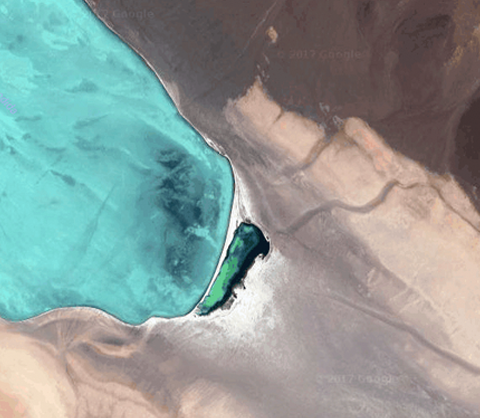

Mappa provides a simple interface when working with static maps (images). It currently supports [Google Maps Static API v2](https://developers.google.com/maps/documentation/static-maps/), [Mapbox Static API v1](https://www.mapbox.com/api-documentation/#styles) and [Mapquest Static API v5](https://developer.mapquest.com/documentation/static-map-api/v5/).

## Usage

```javascript
.staticMap(lat, lng, zoom, width, height, ?options)
```
or
```javascript
.staticMap(options)
```
> Creates a static map image with the provided parameters. Returns an object.

Required parameters:
+ `lat`: latitude for the center of the image.
+ `lng`: longitude for the center of the image.
+ `zoom`: zoom of the image. Min 1. Max 16.
+ `width`: width in pixels.
+ `height`: height in pixels.

Optional:
+ Google:
  - `scale`: number of pixels returned. Defaults to `1`.
  - `format`: gif, png or jpg. Defaults to `png`.
  - `language`: language of the map. Defaults to `english`.
  - `maptype`: Type of map used. Defaults to `roadmap`.

For a complete reference visit [Google Maps Static API Documentation](https://developers.google.com/maps/documentation/static-maps/intro).

+ Mapbox:
  - `scale`: number of pixels returned. Defaults to `1`.
  - `pitch`: tilts the map. Defaults to `0`.
  - `bearing`: rotates the map around its center. Defaults to `0`.
  - `style`: mapbox styles. default to `satellite-streets-v10`.
  - `attribution`:  boolean value to show map attribution. Defaults to `true`.
  - `logo`: boolean value to show mapbox logo on the image; defaults to `true`.

For a complete reference visit [Mapbox Static API Documentation](https://www.mapbox.com/api-documentation/#static).

+ Mapquest:
  + `scale`: number of pixels returned. Defaults to `1`.
  + `type`: Type of map used. Defaults to `hyb`.
  + `scalebar`: boolean value to show a scale. Defaults to `false`.
  + `traffic`: boolena to show traffic flow. Defaults to `false`.
  + `banner`: add a custom banner.

For a complete reference visit [Mapquest Static API Documentation](https://developer.mapquest.com/documentation/static-map-api/v5/).

### Examples:
```javascript
// Create an image of New York of 500x500 with a zoom level of 10.
const myMap = mappa.staticMap(40.782, -73.967, 10, 500, 500)
```

```javascript
// Set the options as an object
const options = {
  lat: 40.782,
  lng: -73.967,
  zoom: 10,
  width: 500,
  height: 500
}
// Create an image of New York of 500x500 with a zoom level of 10.
const myMap = mappa.staticMap(options)
```

The resulting URL of the image will be stored inside the `imgUrl` value of the `myMap` variable. To load the image in p5 use [`loadImage()`](https://p5js.org/reference/#/p5/loadImage) in [`preload()`](https://p5js.org/reference/#/p5/preload) as with any other p5 image:

```javascript
let img;

function preload(){
  img = loadImage(myMap.imgUrl);
}
```

### Complete Example:

```javascript

// Your Google Maps API Key
const key = 'abcd'

// Create a new Mappa instance using Google.
const mappa = new Mappa('Google', key);

// Map options
const options = {
  lat: -26.658045,
  lng: -68.512952,
  zoom: 10,
  width: 640,
  height: 640,
  scale: 1,
  format: 'PNG',
  language: 'en',
  maptype: 'satellite'
}
let img;

// Create a map image of the Chilean Dessert
const myMap = mappa.staticMap(options);

// Load the image from the mappa instance as any other p5 image.
function preload(){
  img = loadImage(myMap.imgUrl);
}

function setup(){
  createCanvas(640,640);
  image(img, 0, 0);
}

```
This will render the following image:



Here are more complete examples when working with [Google Maps](examples-google-maps-static.md), [Mapbox](examples-mapbox-static.md) and [Mapquest](examples-mapquest-static.md).