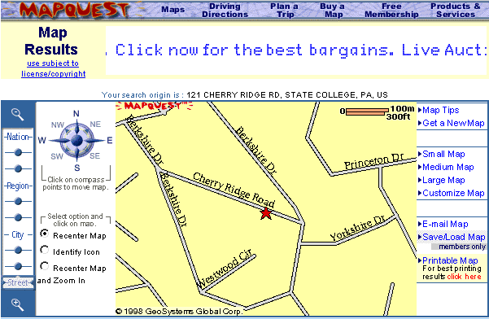

# An Introduction to Web Maps 

This guide is intended to provide a quick overview of some of the main concepts when working with web maps. Maps and web maps are extensive topics and this guide is not intended to go over all concepts. Instead, this page will serve as an introductory lesson for people that have little to no  experience working with maps on the web.

Contributions are welcome! 

Index of contents:

 - [A very quick history of web maps](#a-very-quick-history-of-web-maps)
    - [Map Providers](#map-providers)
    - [Map Projections](#map-projections)
    - [Web Map Libraries](#web-map-libraries)
 - [Custom Maps](#custom-maps)
 - [Overlaying things on a Map](#overlaying-things-on-a-map)
 - [What's next](#whats-next)
 - [References and Further Readings](#references-and-further-readings)

## A very quick history of web maps

In 1996 a company called [Mapquest](http://www.mapquest.com/) introduced a web service for displaying maps on the web. The service allowed people to zoom and pan over a map. However, every map displayed was created by the server as a single, static image. That meant that everytime you requested a new zoom level or moved the map in any direction, you would have to request an entirely new image from the server. 



In 2005, Google released [Google Maps](https://en.wikipedia.org/wiki/Google_Maps) and revolutionized web mapping. After acquiring the technology from another company, originally developed as a desktop service, Google Maps implemented a novel technique to render maps on the web: [Tile Mapping](https://en.wikipedia.org/wiki/Tiled_web_map). Tile Mapping stitches together a collection of smaller images to create a complete map view. Used with [AJAX](https://developer.mozilla.org/en-US/docs/AJAX/Getting_Started), this techinique allows users to zoom and move about the map while keeping most of the tiles that are still relevant and only fetching new ones.  


While most web maps continue to use tile mapping, many map providers are shifting towards a different technique called [Vector Tile Maps](https://en.wikipedia.org/wiki/Vector_tiles). Instead of sending grids of images to the client, Vector Tile maps send packets of information about a tile and then the client renders in real-time those packets in the browser to make a map. This allows for a smoother experience since the client is rendering and fetching data during runtime.

#### Map Providers

In the end, web maps are just collections of images (or data about how to render those images) that are stitched together. The next question is, well how do we get those images and use them.

There are several map companies that offer web map services. Some of these companies are: [Google Maps](maps.google.com), [Mapbox](mapbox.com) and [Mapzen](mapzen.com). These companies provide a variety of products and services in cartography, including the privilege to access their servers for the images necessary to load and render a map. In most cases, these services can be used for free and are paid only if you request large amounts of data.

But there is also a free and open source alternative. [Open Street Map](https://www.openstreetmap.org/#map=4/38.01/-95.84) is a collaborative project that aims to create a free and editable map of the world. This service is open for anyone to use and edit, and does not require any type of registration.

#### Map Projections

Since the earth is a sphere and your screen is a flat 2D surface, a [Map Projection](https://en.wikipedia.org/wiki/Map_projection) is required to transfer latitudes and longitudes of locations from the surface of a the earth and onto a two-dimensional plane. An important thing to remember is that ALL two-dimensional map projections distort the surface in some way.

There are [different map projections](https://en.wikipedia.org/wiki/List_of_map_projections) used for different purpuses and cases. Today, most web map providers use the [Mercator Projection](https://en.wikipedia.org/wiki/Mercator_projection). Originally designed for nautical purposes, the Mercator has become one of the standars for web maps. One important thing to consider is that the Mercator Projection disorts the plane towards the poles, showing them far more bigger than what they really are. This make things look much more bigger than what they really are.


Mercator disortion towards the poles

Map Projections are a hotly debated topic because of how they dissort information. To learn more:

- [True Size](https://thetruesize.com/#?borders=1~!MTU2Mzk2Mzk.NDc2MjAxMQ*Mjg5MDYyMjE(ODU4NTkwOA~!CONTIGUOUS_US*MTAwMjQwNzU.MjUwMjM1MTc(MTc1)MA~!IN*NTI2NDA1MQ.Nzg2MzQyMQ)MQ~!CN*OTkyMTY5Nw.NzMxNDcwNQ(MjI1)Mg)
- [Extreme Mercator](https://mrgris.com/projects/merc-extreme/#0b6b7dd3@)
- [Vox - Why all world maps are wrong](https://www.youtube.com/watch?v=kIID5FDi2JQ)
- [The West Wing - Season 2 Episode 16](https://www.youtube.com/watch?v=vVX-PrBRtTY)

####  Web Map Libraries

o request and use a tile map from any map provider(free or paid) you need to use a javascript library to load those tiles in the right way and fetch them when needed. Which library to use depends on the which map provider you are using. If you want to load maps from Google you need to use [Google Maps'](https://developers.google.com/maps/) own library. For almost all other map providers you can use a free and open-source library called [Leaflet](http://leafletjs.com/). Leaflet is a very popular library for web maps. Although [Mapbox](https://www.mapbox.com/mapbox.js/api/v3.1.1/) and [Mapzen](https://mapzen.com/documentation/mapzen-js/) have their own javascript libraries, both are extensions of [Leaflet](http://leafletjs.com/) that have custom code but are open source as well.

## Custom Maps 

You can also create and host your own tiles. While this is beyond the scope of this introduction, you can use a server to deliver custom-based tiles and style them with [TileMill](https://tilemill-project.github.io/tilemill/) or something similar.

Another alternative is to customize and change existing web maps. You can do this with most services, either when requesting them or using their services like [Mapbox Studio](https://www.mapbox.com/studio/styles/).

## Overlaying things on a Map

One thing is to load and display a map and another is to show things on top of that map, for instance a marker pointing to your home. With [Leaflet](http://leafletjs.com/) and [Google Maps](https://developers.google.com/maps/) you can overlay and position elements over the map in a very easy way. Here is the sample code from Leaflet's home page to overlay a marker over an Openstreet map:

```javascript
// Creates the map object and attaches that object to the body of the html. This also sets the starting latiute, longitud and zoom level
var map = L.map('map').setView([51.505, -0.09], 13);

// Select which tile layers to show. In this case, OSM
L.tileLayer('http://{s}.tile.osm.org/{z}/{x}/{y}.png', {
    attribution: '&copy; <a href="http://osm.org/copyright">OpenStreetMap</a> contributors'
}).addTo(map);

// Add a marker to the map in lat 51.5 and lng -0.09
L.marker([51.5, -0.09]).addTo(map)
    .bindPopup('A pretty CSS3 popup.<br> Easily customizable.')
    .openPopup();
```
Results in this:


And here is the code for doing the same with Google Maps (Taken form [here](https://developers.google.com/maps/documentation/javascript/examples/icon-simple)):
```javascript
var map = new google.maps.Map(document.getElementById('map'), {
          zoom: 4,
          center: {lat: -33, lng: 151}
        });

var image = 'icon.png';
var beachMarker = new google.maps.Marker({
          position: {lat: -33.890, lng: 151.274},
          map: map,
          icon: image
      });
```

Results in this:


One thing you will notice is that these are static icons that are fixed to a specific location in the map. You can move and zoom around and the markers will stay in position. But what if you want to do something more interactive? Perhaps add movement and sound to it? You can create and build your own separate overlays for each map provider or you can build using [Mappa](https://github.com/cvalenzuela/Mappa). Mappa allows you to attach a `<canvas>` object on top of a tile map for almost all map providers. This means, for example, you can overlay a [p5.js](https://github.com/processing/p5.js) sketch in top of a map and bind them together, just as with the marker. This allows you to create more interactive experiences:


Gif from [TradeFlow](http://tradeflow.3laab.com/), built with Mappa and p5.

## What's next?

Now with an understanding of the basics concepts around web maps, follow the [Basic Example](../basic) to build a simple example.

## References and Further Readings

- [Mimi Onuoha's Everything is Spatial: Data and Digital Mapping](https://mimionuoha.github.io/spring2017-digitalmapping/weekone/#/)
- [Mapbox Guide to Map Design](https://www.mapbox.com/resources/guide-to-map-design-part-1.pdf)
- [How Mapbox works](https://www.mapbox.com/help/how-mapbox-works-overview/)